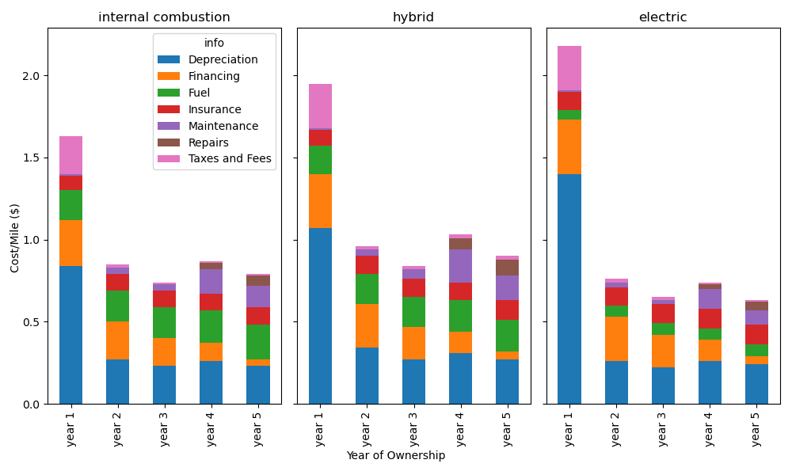

 ## Five Year Cost of Ownership

According to the US census, 91.9% of households have at least one vehicle [<a href="#item1">1</a>]. One of the most expensive items that an average person spends in their lifetime is a vehicle [<a href="#item2">2</a>]. There are currently three major types of cars based on fuel types currently on the market today. They are the internal combustion engines vehicles, internal combustion engines with supplemental battery vehicles or hybrids, and fully electric vehicles or evs [<a href="#item3">3</a>]. Arguments have been made to encourage the purchase of evs over traditional internal combustion engine cars that burns fuel and increases carbon dioxide emissions. The environmental protection agency reported that of the 5,586 metric tons of carbon dioxide emissions in the United States, 29% of the Greenhouse gas emission is produced by transportation [<a href="#item4">4</a>]. To combat the increase in Greenhouse gasses, on December 8, 2021, President Biden sign an executive order aiming to end purchases of vehicles that produce emission by the federal government by 2027 for light-duty vehicles (10,000 pounds or 4,536 kg [<a href="#item5">5</a>]) and by 2035 for other vehicles in a push to create a clean energy economy [<a href="#item6">6</a>]. This was done in hopes of encouraging the increase in the number of all electric vehicles [<a href="#item7">7</a>].

Ultimately, it was found in a 2022 survey, the fuel efficiency, safety and low price was the most important consideration when purchasing a new vehicle [<a href="#item8">8</a>] and not environmental concerns. What many do not account for is the hidden cost of buying a vehicle is the cost of ownership. There exist several websites that calculate a 5 year estimate for the cost of ownership [<a href="#item9">9</a>,<a href="#item10">10</a>,<a href="#item11">11</a>] with non-existent api’s or restricted access to them based on commercial usage. For the purpose of this project, data was extracted from the Edumunds database. Tables from the html pages were extracted from a subset of 2023 vehicle data using a python script[<a href="#item12">12</a>. The data was converted and saved as cvs files in the Resources folder. The file analysis_5year_ownership_all.ipynb contains the analysis of the yearly cost of ownership for five years for a new 2023 internal combustion engine cars or traditional gas cars, hybrid and electric cars which reads the Edmunds.csv, Edmunds_hybrid.csv and Edmunds_ev.csv data files. The data extracted was confined to only examine cars, specifically sedans and SUVs, from the model year 2023 due to the limiting number of models and data available of fully electric cars in prior years. The actual cost of ownership will vary from person to person and on what assumptions the databases use assumes. The seven main factors examined for the cost of ownership included in this analysis are taxes and fees, fuel, maintenance, repairs, financing costs or interest, insurance premiums and depreciation.

Edumonds assumes an average deprecation of 23.5% of the manufacturer’s suggested retail price for the first year of ownership and a 60% deprecation in five years. They also assume that a typical person drives 15,000 miles/year 55% of the time in the city and 45% on the highways. A 60 months finance term with 10% of the cost of the vehicle down is used in their estimations. The actual price of fuel or electricity and the amount of taxes paid depends on the location. For the purpose of this analysis Mid-Michigan is used. 

Figure 1: The total yearly cost of ownership for a new 2023

The total yearly cost to own a new 2023 vehicle being considered in this analysis for five years is plotted in Figure 1. The three fuel types being considered are examined separately to determine if there is any trends. The most noticeable feature is that regardless of the vehicle model, the first year of ownership is the most expensive and each subsequent year the cost is significantly reduced relative to the first year. After the first year, the average yearly cost of ownership is around $10,500 for electrics, $13,900 for hybrids and $12,400 for gas vehicles. In the yearly cost in the second through fifth years, the electric cars end up costing slightly less than. This behavior be seen more clearly in the itemized yearly cost Figure 2. The means of all cars in the csv files are calculated based on the fuel type to determine the cost per 15,000 miles. In all cases, the Edmund database predicts that the largest yearly expense is the depreciation. Although the cost for taxes, fees and financing decreases over time, the maintenance and repairs increases resulting a possible slight dip in the third year. Over the course of five years, the total cost to maintain an electric vehicle and traditional gas car are similar while the hybrid vehicle remains more expensive to maintain.

Figure 2: The itemized cost per year

Since depreciation is the largest expense in ownership, we examined this a little more closely to see if this expense could be reduced. In Figure 3, the yearly depreciation is plotted against the initial cost to purchase the vehicle. In each case, there appears to be a linear dependence on deprecation. The first year has about a factor of two larger slope compared to the other years, enforcing the conclusion that the depreciation for the first year is the most significant. The depreciation is around $0.89 and $0.91 more per mile for the $100,000 vehicle compared to a $40,000 one in the first year for an electric or gas car and hybrid, respectively. This suggests cheaper vehicle can significantly reduce the first year expense.

Figure 3: The itemized cost per year

### References 

<ol>
    <li id="item1"> U.S. Census Bureau 5-Year American Community Survey (2018-2022) https://data.census.gov/table/ACSDP5Y2022.DP04?g=040XX00US15&tid=ACSDP5Y2022.DP04 >|</li>
	<li id="item2"> Knueven, L. "The 7 most expensive things you’ll ever pay for, according to financial planners." Business Insiderhttps://www.businessinsider.com/personal-finance/most-expensive-things-americans-will-pay-for-2019-8, Aug 15, 2019. </li>
	<li id="item3"> "Powertrains & fuel types explained", https://www.carmax.com/research/powertrains-and-fuel-types</li>
	<li id="item4"> inventory-us-greenhouse-gas-emissions-and-sinks</li>
	<li id="item5"> United States Environmental Protection Agency https://www.epa.gov/moves/how-does-moves-define-light-duty-trucks</li>
	<li id="item6"> "FACT SHEET: President Biden Signs Executive Order Catalyzing America’s Clean Energy Economy Through Federal Sustainability The White House briefing room statements and release" https://www.whitehouse.gov/briefing-room/statements-releases/2021/12/08/fact-sheet-president-biden-signs-executive-order-catalyzing-americas-clean-energy-economy-through-federal-sustainability, Dec 8, 2021.</li>
	<li id="item7"> Tankersley, J,  Swanson, A., Ewing, J,  and  Davenport, C. "A New Law Supercharged Electric Car Manufacturing, but Not Sales" https://www.nytimes.com/2023/11/08/business/energy-environment/electric-vehicles-biden.html </li>
	<li id="item8"> Armstrong, M., "Most Important Factors When Buying a Car". https://www.statista.com/chart/13075/most-important-factors-when-buying-a-car/
	<li id="item9"> https://www.aaa.com/autorepair/drivingcosts </li>
	<li id="item10"> https://www.kbb.com/new-cars/total-cost-of-ownership/ </li>
	<li id="item11"> https://www.edmunds.com/tco.html </li>
	<li id="item12"> https://github.com/ekfrib23/project1-ev-ice/read.py
	  https://github.com/ekfrib23/project1-ev-ice/ was used for the initial commits to github for this analysis </li>
</ol>

